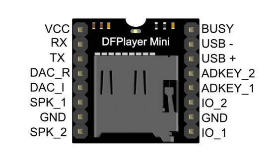
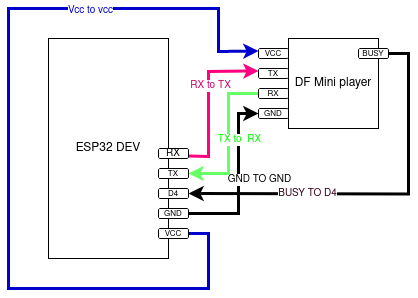

# esp32-micropy-dfplayer


Micropython implementation of DFPlayer control using UART 1 (secondary Serial connection) on ESP32

Credit for this repository goes to [repo](https://github.com/ShrimpingIt/micropython-dfplayer).
I cloned this repo and make some changes to work with ESP32.
I didn't fork it because that was for ESP8266 and I am making change for ESP32 

If you are not limited to ESP32 (with its TX-only UART) you should consider using [this repo](https://github.com/jczic/KT403A-MP3/blob/master/kt403A.py) instead.

To use, wire up the DFPlayer Mini MP3 breakout module following this loom...





* DFPlayer Mini
    | DfPlayer                             |            ESP32                           |
    * VCC                                 =>            5V Vin of ESP32
    * Busy Pin (immediately opposite VCC) =>            GPIO4 (ESP32 D4)
    * RX Pin (immediately below VCC)      =>            TX Pin (TX2 of ESP32)
    * TX Pin (immediately below RX)       =>            Rx Pin (RX2 of ESP32)
    * GND pin (immediately below SPK1)    =>            GND of ESP32 + Tip of 3.5 mm Jack(optional)
    * DAC_R                               =>            Ring1 of 3.5 mm Jack(optional) 
    * DAC_L                               =>            Tip of 3.5 mm Jack(optional)
    * SPK1+SPK2 to a 3W speaker (limiting the volume to 0.5 can help prevent brownout for larger wattage speakers)





The following example code uses the ScanPlayer. 

It considers only folders named 00-09.

It will first scan all available folders for files called 000_XXX.mp3 001_XXX.mp3 and so on.

It will play a single track from each folder in turn, only repeating a folder 
when all folders are exhausted, and only repeating a track when all tracks have been exhausted. 


```python
from time import sleep
import scanplayer
player = scanplayer.ScanPlayer()
available_folders = list(player.tracks.keys())
if len(available_folders) > 0:
    key_pos = 0
    while True:
        folder = available_folders[key_pos]
        player.finish_all(folder)
        while player.playing():
            sleep(0.1)
        key_pos = (key_pos + 1) %  len(available_folders)
else:
    print("No available tracks")
```


